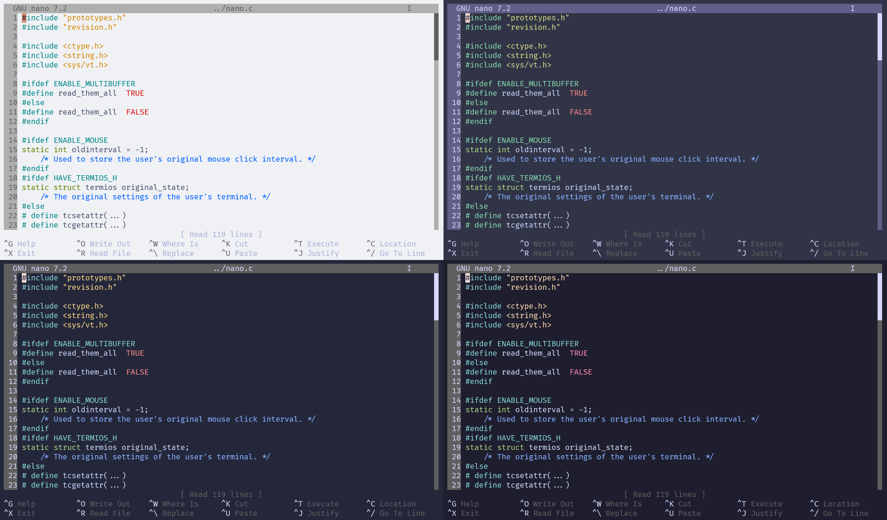
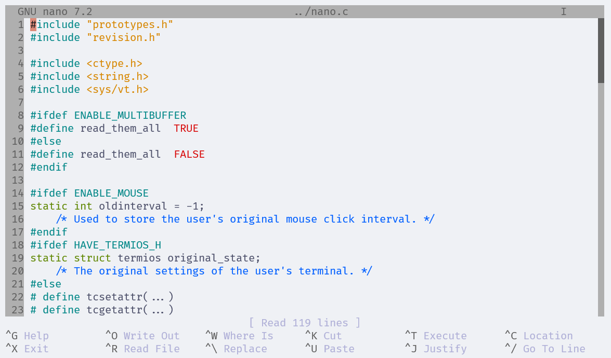
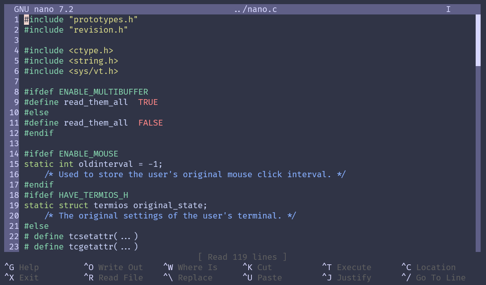
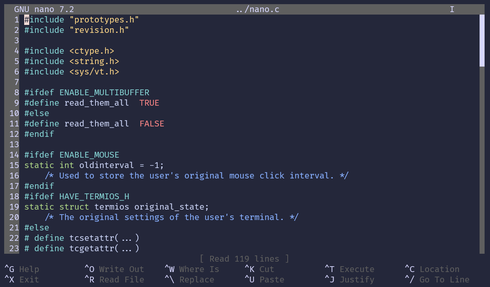
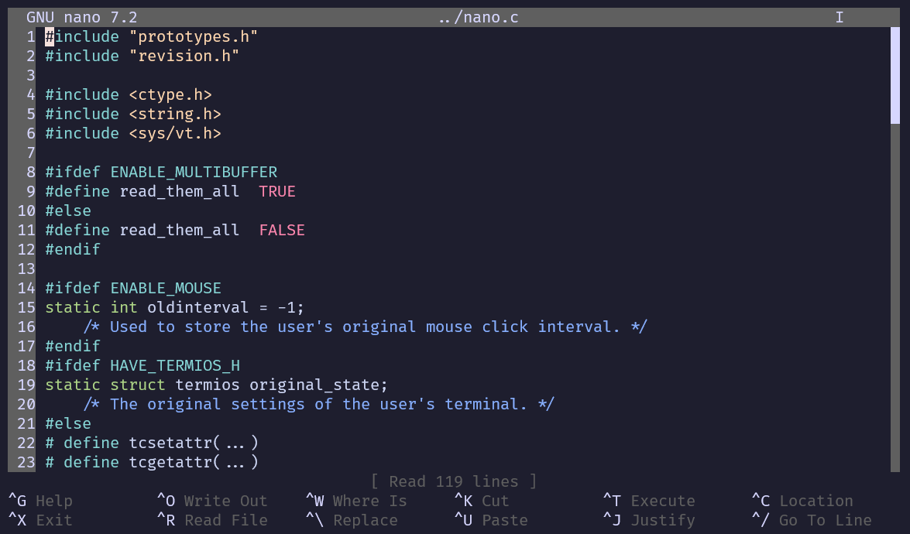

<h3 align="center">
	<br/>
	
	Catppuccin for <a href="https://www.nano-editor.org/">GNU nano</a>
	
</h3>

<p align="center">
	<a href="https://github.com/ahmadnassri/catppuccin-node/stargazers"></a>
	<a href="https://github.com/ahmadnassri/catppuccin-node/issues"></a>
	<a href="https://github.com/ahmadnassri/catppuccin-node/contributors"></a>
</p>


<p align="center">
	
</p>

## Previews

<details>
<summary>🌻 Latte</summary>

</details>
<details>
<summary>🪴 Frappé</summary>

</details>
<details>
<summary>🌺 Macchiato</summary>

</details>
<details>
<summary>🌿 Mocha</summary>

</details>

## Usage

> [!WARNING]
> GNU nano version `6` or later is required!

### Quick Setup _(default syntax files)_

1. clone this repo locally

    ```shell
    git clone https://github.com/ahmadnassri/catppuccin-nano.git ~/.nano
    ```
1. use the included `.nanorc` config _(or edit your existing one to match)_

    ```shell
    ln -s ~/.nano/.nanorc ~/.nanorc
    ```

### Advanced Setup _(BYO-syntax files)_

> [!IMPORTANT]
> Node.js v23+ is required

1. clone this repo locally

    ```shell
    git clone https://github.com/ahmadnassri/catppuccin-nano.git /tmp/catppuccin-nano
    ```
1. setup the Node.js project

    ```shell
    cd catppuccin-nano
    npm install
    ```

1. run the builder while specifying path to your existing syntax files as `PATH_NANORC_SOURCE` and write destination as `PATH_NANORC_TARGET`

    ```shell
    export PATH_NANORC_SOURCE=/my/nano/syntax
    export PATH_NANORC_TARGET=./my/nano/catppuccin
    npm run build
    ```

1. use the included `.nanorc` config _(or edit your existing one to match)_

    ```shell
    ln -s /my/nano/catppuccin/.nanorc ~/.nanorc
    ```

> [!Note]
> only files with the extension `.nanorc` are considered

## 🙋 FAQ

- Q: **_"nano does not support custom color values, so how does this work?"_**\
  A: nano syntax highlighting options are very limited, so this approach overwrites all existing syntax files by replacing built-in color names with appropriate mappings as defined in [`color-map.json`](./src/color-map.json)

<!--
## 💝 Thanks to

- [Human](https://github.com/catppuccin)
-->
&nbsp;

<p align="center">
	
</p>

<!-- temporarily hidden, waiting to see if this repo will be adopted by the official org
<p align="center">
	Copyright &copy; 2021-present <a href="https://github.com/catppuccin" target="_blank">Catppuccin Org</a>
</p>
-->
<p align="center">
	<a href="https://github.com/ahmadnassri/catppuccin-node/blob/main/LICENSE"></a>
</p>
